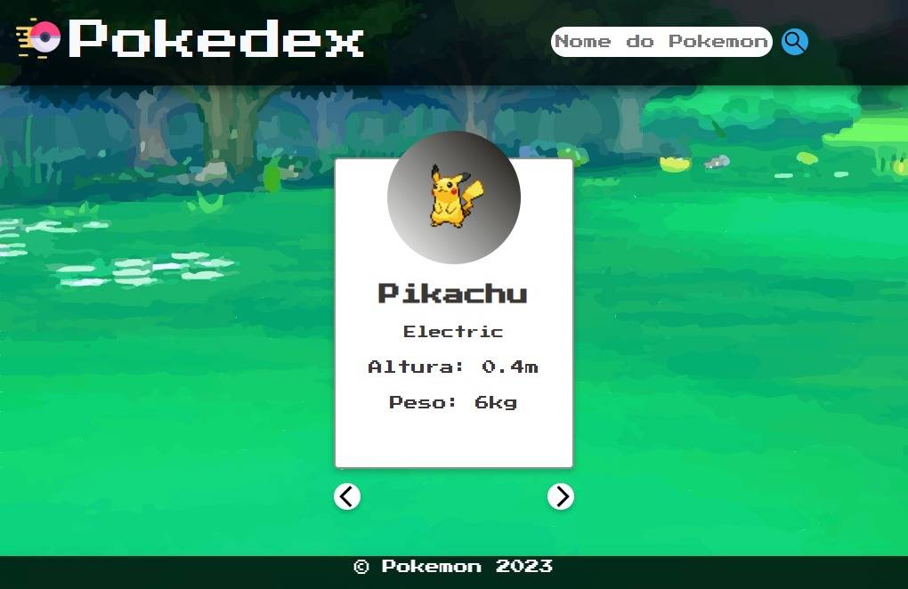

<h1 align="center"> Pokedex </h1>

Projeto de uma Pokedex para armazena os pokemons e suas informações.

  &nbsp;&nbsp;&nbsp;|&nbsp;&nbsp;&nbsp;
  <a href="#-tecnologias">Tecnologias</a>&nbsp;&nbsp;&nbsp;|&nbsp;&nbsp;&nbsp;
  <a href="#-projeto">Projeto</a>&nbsp;&nbsp;&nbsp;|&nbsp;&nbsp;&nbsp;
  <a href="#-licença">Licença</a>&nbsp;&nbsp;&nbsp;|&nbsp;&nbsp;&nbsp;

  

 

  

## 🚀 Tecnologias

Esse projeto foi desenvolvido com as seguintes tecnologias:

- HTML e CSS
- JavaScript
- Git e Github

## 💻 Projeto

Uma pokedex que mostra o Pokemon e suas informações.
- [Visite o projeto](https://leomazuka.github.io/Pokedex/)

## 📂 Licença

Esse projeto está sob a licença MIT.

---

Feito por Leonardo Soares Mazuqueli
